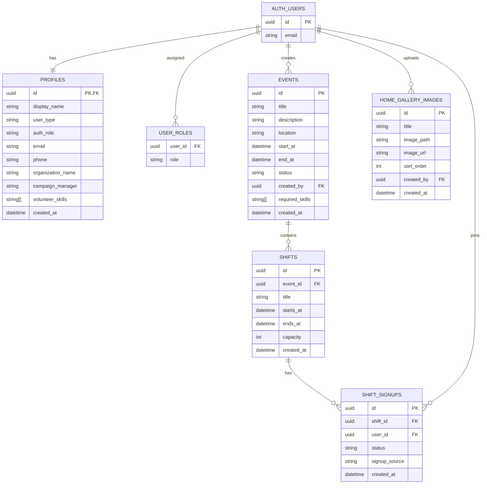

# Volunteer Coordination Platform

## Project Description
Volunteer Coordination Platform is a web app for managing volunteer campaigns.
It supports public visitors and authenticated users with role-based access.

### Roles
- Volunteer: can create/update their profile, manage personal skills, browse campaigns, apply/leave campaigns, and track participation.
- Organizer: can create and manage their own campaigns, define required campaign skills, invite matching volunteers, and monitor campaign activity.
- Admin: can oversee all users and campaigns, manage user accounts/roles, edit volunteer/campaign skills, and manage home-page gallery images.

## Architecture Overview
- Frontend: Vite + vanilla JavaScript, configured as a true multipage build with separate entries:
  - `/` -> `index.html`
  - `/auth/` -> `auth/index.html`
  - `/dashboard/` -> `dashboard/index.html`
  - `/dashboard/total` -> `dashboard/total/index.html`
  - `/dashboard/ongoing` -> `dashboard/ongoing/index.html`
  - `/dashboard/paused` -> `dashboard/paused/index.html`
  - `/dashboard/ended` -> `dashboard/ended/index.html`
  - `/profile/` -> `profile/index.html`
  - `/campaign/` -> `campaign/index.html`
- Backend/Platform: Supabase
  - Auth: email/password authentication with unified `Log In / Register` flow.
  - Database: PostgreSQL tables, SQL migrations, and RPC functions.
  - Storage:
    - `home-gallery` (home gallery + theme assets)
    - `event-covers` (campaign avatars)
    - `attendance-proofs` (profile avatars)
  - Security: Row Level Security (RLS) policies on core tables and admin-only RPC authorization checks.

## Database Schema Diagram (Mermaid ERD)


## Local Setup Guide
1. Install dependencies:
   ```bash
   npm install
   ```
2. Create local env file from template:
   ```bash
   cp .env.example .env.local
   ```
3. Set required Supabase client variables in `.env.local`:
   ```env
   VITE_SUPABASE_URL=your_supabase_project_url
   VITE_SUPABASE_ANON_KEY=your_supabase_anon_key
   ```
4. (Optional, for seed/admin bootstrap) set:
   ```env
   SUPABASE_URL=your_supabase_project_url
   SUPABASE_SERVICE_ROLE_KEY=your_service_role_key
   ADMIN_EMAIL=admin@example.com
   ADMIN_PASSWORD=change_me_secure_password
   ADMIN_DISPLAY_NAME=Platform Admin
   ```
5. Start the app:
   ```bash
   npm run dev
   ```
6. Open:
   - `http://localhost:5173`

## Key Folders/Files
- `src/home-entry.js` - home page bootstrap
- `src/auth-entry.js` - auth page bootstrap
- `src/dashboard-entry.js` - dashboard page bootstrap
- `src/profile-entry.js` - profile page bootstrap
- `src/campaign-entry.js` - campaign page bootstrap
- `src/lib/supabase.js` - Supabase client + data/auth API calls
- `src/pages/index/` - public home page
- `src/pages/auth/` - unified login/register UI
- `src/pages/dashboard/` - role-aware dashboard (admin/organizer/volunteer)
- `src/pages/campaign/` - campaign details/create/edit page
- `src/pages/profile/` - user profile page
- `src/components/header/` and `src/components/footer/` - shared layout components
- `supabase/migrations/` - SQL schema, RLS, RPC, and role/auth migrations
- `supabase/seed.js` - sample users and campaigns seed script
- `supabase/run-migrations.ps1` - helper script for Supabase migration push

## Deployment (Netlify / Vercel)
The repository now includes hosting config for both providers:
- `netlify.toml` (Netlify build settings)
- `vercel.json` (Vercel routing/build settings)

### Netlify (recommended)
1. Connect this GitHub repository in Netlify.
2. Set build command: `npm run build`
3. Set publish directory: `dist`
4. Add environment variables:
   - `VITE_SUPABASE_URL`
   - `VITE_SUPABASE_ANON_KEY`
5. Deploy.

### Vercel
1. Import this repository in Vercel.
2. Framework preset: `Vite` (or leave auto-detected).
3. Add environment variables:
   - `VITE_SUPABASE_URL`
   - `VITE_SUPABASE_ANON_KEY`
4. Deploy.

## Live Deployment URL
- Netlify: `https://volunteercoordinationplatform.netlify.app/`

### Dashboard Filter URLs
- Total: `https://volunteercoordinationplatform.netlify.app/dashboard/total`
- Ongoing: `https://volunteercoordinationplatform.netlify.app/dashboard/ongoing`
- Paused: `https://volunteercoordinationplatform.netlify.app/dashboard/paused`
- Ended: `https://volunteercoordinationplatform.netlify.app/dashboard/ended`

## Demo Credentials
For local/demo environments only:

- Admin:
  - Email: `plamena@gmail.com`
  - Password: `123456`
- Organizer:
  - Email: `lili@gmail.com`
  - Password: `123456`
- Volunteer:
  - Email: `peter@gmail.com`
  - Password: `123456`

> Important: rotate/remove demo credentials before production use.
